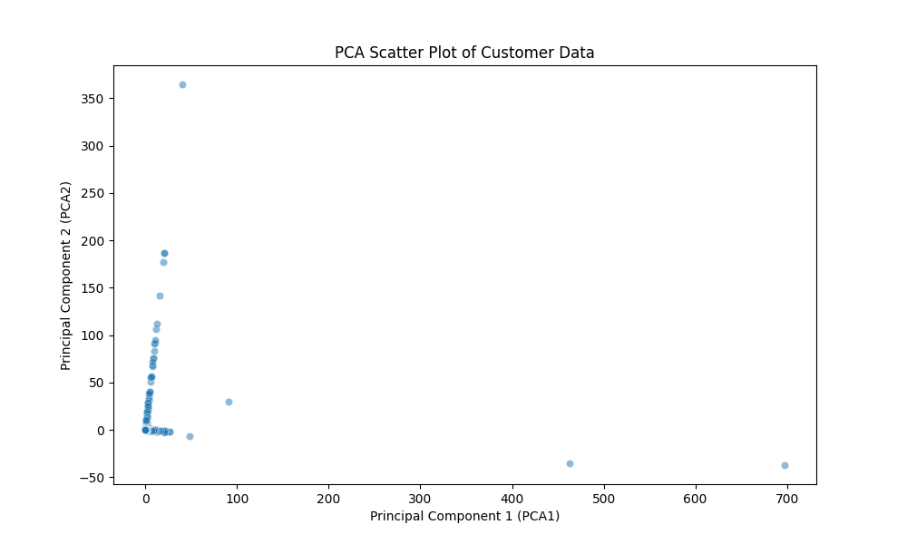

#  Customer Analytics Pipeline

This project implements a **4-stage automated analytics pipeline** using Python and Docker to process customer transaction data (Online Retail dataset).  
All scripts are chained to run sequentially within a container to ensure full reproducibility.

---

##  How to Run

### 1- Build Docker Image
```bash
docker build -t pipeline-image .
```

### 2- Run Container
```bash
docker run -it --name analytics_pipeline pipeline-image
```

### 3- Execute Pipeline
Inside the container, run:
```bash
python ingest.py data.csv
```

When finished, all outputs will be generated automatically:
- `data_raw.csv`
- `data_preprocessed.csv`
- `insight1.txt`, `insight2.txt`, `insight3.txt`, `clusters.txt`
- `summary_plot.png`

### 4- Exit and Copy Results    
```bash
exit
bash summary.sh
```

All generated results will be in the `results/` folder.

---

##  Project Structure

```
customer-analytics/
├── Dockerfile
├── ingest.py
├── preprocess.py
├── analytics.py
├── visualize.py
├── cluster.py
├── summary.sh
├── README.md
└── results/
```

---

##  Pipeline Summary   

| Stage | Script | Description |
|-------|---------|-------------|
| 1- | `ingest.py` | Loads the raw dataset and saves a clean copy as `data_raw.csv`. |
| 2- | `preprocess.py` | Cleans missing/duplicate data, encodes, scales, and applies PCA. |
| 3- | `analytics.py` | Generates 3 key business insights and saves as text files. |
| 4- | `visualize.py` | Produces visual analytics (see PCA plot below). |
| 5- | `cluster.py` | Applies K-Means clustering and outputs cluster summary. |

---

##  Results Overview

###  Insights Summary
```
Top Countries:
United Kingdom: 349,227
Germany: 9,027
France: 8,327
EIRE: 7,228
Spain: 2,480
```

```
K-Means Cluster Counts:
Cluster 0: 392,702
Cluster 1: 2
Cluster 2: 23
Cluster 3: 5
```

###  PCA Visualization
Below is the actual PCA scatter plot generated by the pipeline:



---

##  Team Members

- Mohammed Helal - 222000064
- Mohammed Abdelghany - 221001586
- Mohammed Elsherbeny - 211002067
- Abdelrahman Selim - 221001155

